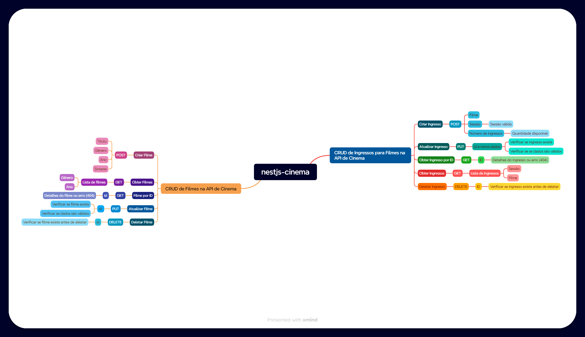

# **Automação de Testes para API de Cinema**

Bem-vindo ao repositório do projeto de automação de testes para a API de Cinema. Este projeto foi desenvolvido como parte do Programa de Bolsas | IFSUL AWS & AI for Software Quality Engineering  e tem como objetivo demonstrar boas práticas em planejamento e execução de testes automatizados com foco na qualidade de software.

---

## **📋 Sumário**

1. [Apresentação Pessoal](#-apresentação-pessoal)  
2. [Objetivo do Projeto](#-objetivo-do-projeto)  
3. [Estrutura do Projeto](#-estrutura-do-projeto)  
4. [Pré-requisitos](#-pré-requisitos)  
5. [Como Configurar e Executar](#-como-configurar-e-executar)  
6. [Cenários e Cobertura de Testes](#-cenários-e-cobertura-de-testes)  
7. [Mapa Mental](#-mapa-mental)  
8. [Issues Encontradas](#-issues-encontradas)  
9. [Plano de Melhoria](#-plano-de-melhoria)  
10. [Contribuições](#-contribuições)  

---

## **👤 Apresentação Pessoal**

- **Nome:** Vicenzo Azambuja
- **Idade:** 22 anos
- **Curso:** Tecnologia em Sistemas para Internet  
- **Semestre:** Terceiro Semestre
- **Cidade:** Pelotas, RS
- **Cor dos olhos:** Castanhos
- **Cor do cabelo:** Castanho escuro  
- **Cor da pele:** Branca
- **Roupa utilizada:** Camiseta branca 

---

## **🎯 Objetivo do Projeto**

O objetivo principal deste projeto é automatizar os testes funcionais da API de Cinema, garantindo que as funcionalidades principais atendam aos requisitos do sistema e estejam livres de falhas.  

**Principais entregáveis:**  
- Código limpo e reutilizável.  
- Testes independentes e de fácil manutenção.  
- Documentação detalhada (README).  

---

## **📁 Estrutura do Projeto**

O projeto segue uma estrutura organizada para garantir escalabilidade e facilidade de manutenção:  

```
📂 cinema-api-tests
├── 📂 tests
│   ├── 📄 criarFilme.spec.js
│   ├── 📄 atualizarFilme.spec.js
│   ├── 📄 deletarFilme.spec.js
│   └── 📄 detalhesFilmeId.spec.js
├── 📂 utils
│   ├── 📄 requestHandler.js
│   └── 📄 dataGenerator.js
├── 📂 configs
│   └── 📄 playwright.config.js
└── 📄 README.md
```

**Principais padrões adotados:**  
- **PageObjects:** Gerenciamento modular de ações em endpoints.  
- **ServiceObjects:** Manipulação direta de requisições HTTP.  
- **AppActions:** Centralização de ações comuns entre testes.  

---

## **🛠️ Pré-requisitos**

Antes de executar o projeto, certifique-se de ter instalado:  

1. [Node.js](https://nodejs.org/) (versão 16 ou superior)  
2. [Playwright](https://playwright.dev/)  
3. Um gerenciador de pacotes: npm ou yarn  
4. Clonar este repositório:  

   ```bash
   git clone https://github.com/Vicenzo-Az/Automacao-de-Testes-para-API-de-Cinema.git
   cd cinema-api-tests
   ```

---

## **🚀 Como Configurar e Executar**

1. **Instale as dependências:**  
   ```bash
   npm install
   ```

2. **Configure o ambiente:**  
   Edite o arquivo `playwright.config.js` para apontar para a URL da API.  

3. **Execute os testes:**  
   Para rodar todos os testes:  
   ```bash
   npx playwright test
   ```

   Para rodar um teste específico:  
   ```bash
   npx playwright test tests/criarFilme.spec.js
   ```

---

## **🧪 Cenários e Cobertura de Testes**

### Cenários Implementados  

| Cenário                          | Objetivo                              | Status  |
|----------------------------------|---------------------------------------|---------|
| Criação de Filme                 | Testar criação com payload válido     | ✅      |
| Atualização de Filme             | Verificar endpoint de atualização     | ⚠️ Bug |
| Detalhes de Filme por ID         | Obter informações por ID existente    | ⚠️ Bug |
| Reserva de Ingressos             | Validar fluxo de reserva completo     | ✅      |
| Deleção de Filme                 | Remover filme com ID válido           | ✅      |

### Cobertura  
- **Endpoints cobertos:** 80%  
- **Verbos HTTP testados:** GET, POST, PUT, DELETE  

---

## **🗺️ Mapa Mental**

Abaixo está uma visão geral das User Stories e cenários cobertos no projeto.  

  

---

## **🐞 Issues Encontradas**

Durante a execução, as seguintes issues foram registradas:  

| ID   | Título                                     | Prioridade | Status    |
|------|-------------------------------------------|------------|-----------|
| 001  | Erro 404 ao atualizar filme               | Alta       | Aberta    |
| 002  | Propriedade `id` ausente ao reservar       | Média      | Aberta    |
| 003  | Erro 400 ao criar filme com payload válido | Alta       | Aberta    |

As issues estão documentadas na aba **Issues** deste repositório para fácil acompanhamento.  

---

## **🔧 Plano de Melhoria**

### Prompt para Planejamento de Testes  

**Prompt:**  
_"Como posso otimizar meus testes de API para garantir maior cobertura funcional e identificar potenciais problemas de integração entre os endpoints? Considere o uso do Playwright e proponha estratégias para validar fluxos interdependentes."_  

---

## **🤝 Contribuições**

Contribuições são bem-vindas! Abra uma issue ou envie um pull request para discussões e melhorias.

--- 
